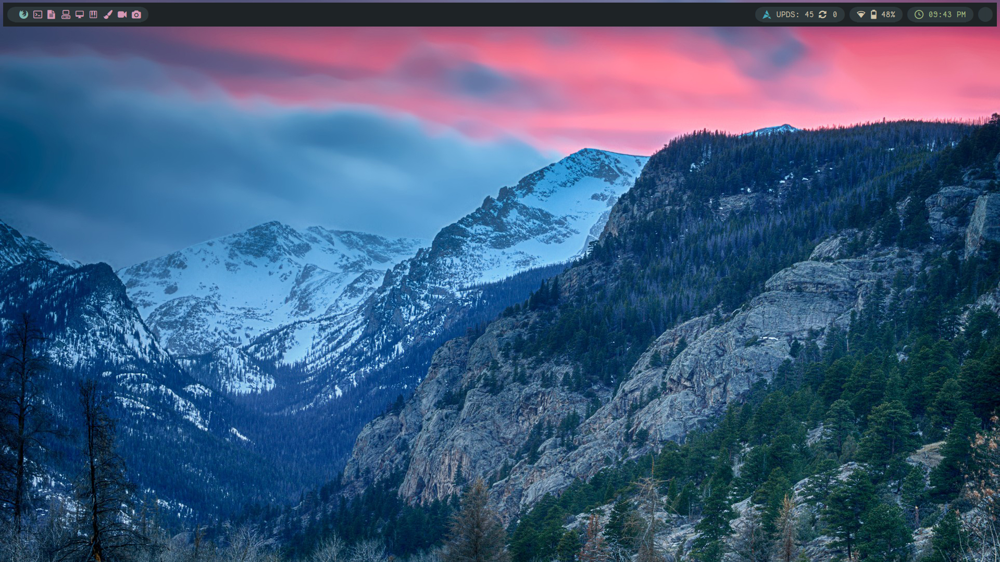

<h1 align="center">WindwardIsland/dotfiles</h1>

</img>

This repository stores all my configuration files for various programs on Linux that I use.

Feel free to poke around in here and take and use whatever you think might be useful on your Linux system.

This repository is managed with [dotdrop](https://github.com/deadc0de6/dotdrop), a dotfile manager written in Python, but configured in YAML. It also creates a local git repo where your dotfiles are copied to and changed, instead of being a bare repo of your entire $HOME. 

I previously used a git bare repository to manage my dotfiles, but I found managing them to be somewhat cumbersome. Being a bare repository, the changes reflected on the remote repo would also reflect locally on my machine. I prefer dotdrop as the local repo is *not* a bare git repo, but rather a regular git repo to which you can just interact with `git`.

**NOTE**: I am currently in the middle of configuring my system, as well as new programs I have yet to try out. I will push dotfiles for those new programs soon, so please be patient!
